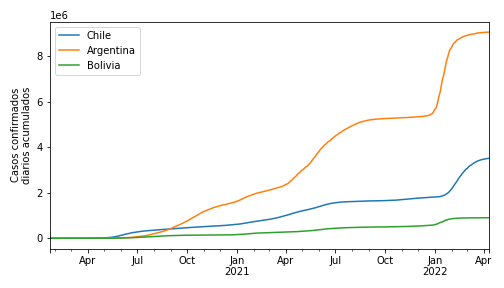
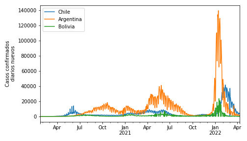

# Exploración de datos mundiales de COVID-19 

**Problema**

En la carpeta `data` de este repositorio encontrará tres archivos `csv` con los registros mundiales de casos de COVID-19 entre el 22 de Enero de 2020 y el 10 de Abril de 2022. Los archivos en cuestión son:

- `covid19_confirmados.csv` : Número de casos diarios acumulado reportados como COVID-19 positivos (confirmados).
- `covid19_recuperados.csv` : Número de casos diarios acumulado reportados como recuperados. 
- `covid19_muerte.csv` : Número de decesos diarios por COVID-19 acumulado. 
- `poblacion_mundial2020.csv`:  Población por país más otros indicadores socioeconómicos al 2020 descargados desde: https://www.kaggle.com/tanuprabhu/population-by-country-2020.

En los primeros tres archivos cada fila corresponde a un país y ciertos casos a un estado/provincia de un país. Las columnas son las coordenadas geográficas (latitud y longitud) y el número de casos diarios para cada día desde Enero de 2020. 

En esta tarea se pide que procese, visualice, analice estos datos. Escriba las rutinas de Python necesarias para resolver las actividades específicas que encontrará en `enunciado.ipynb` usando las librerías vistas en el curso. Discuta con sus compañeros de grupo y complete con su análisis donde corresponda.

**Ejemplo**

A continuación se muestra una gráfica de la series de tiempo del número de casos confirmados acumulados de Chile, Argentina y Bolivia. 

A partir de esta información se puede calcular la serie de tiempo de los casos confirmados "nuevos" por día.

**Referencias**

Los datos a utilizar en esta tarea fueron recopilados por investigadores del [Center for Systems Science and Engineering (CSSE) de la Universidad John Hopkins](https://github.com/CSSEGISandData/COVID-19). En el repositorio original puede investigar sobre las fuentes consultadas por el CSSE.

Nota: Según el CSSE, la información de casos recuperados debe analizarse con cautela pues podría estar considerablemente subestimada. 

## Instrucciones generales

- Lean cuidadosamente `enunciado.ipynb` y complete donde corresponda.
- Sus resultados se evaluarán en base al último *commit* de la rama *main* antes de la fecha y hora de entrega.
- Haga *commits* con sus avances regularmente. Se evaluará su progreso en base al histórico de *commits*.
- No está permitido compartir código ni discutir con otros grupos. Se espera que sigan el [código de ética de la ACM](https://www.acm.org/code-of-ethics).
- Para consultas utilice los canales de discord del curso. No se aceptarán consultas asociadas a errores en el código si su repositorio no está actualizado.

